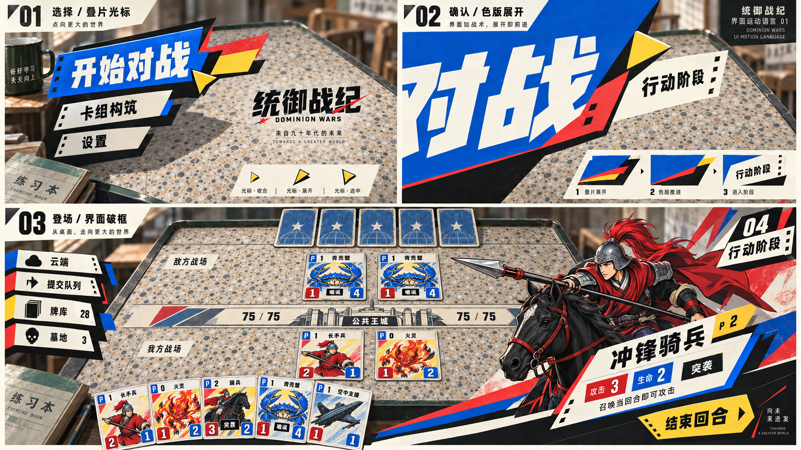

# 已认可的视觉方向：叠片、套色与破框

日期：2026-09-08。

状态：**方向认可（DIRECTION APPROVED）**。不是完整视觉系统、精确布局、正式素材或实机动效验收。

人类负责人原话：“没错就是这样……这个大概的方向我认可了”。对应下方三格样稿，后续设计以此为正向基线，不退回规整怀旧面板。

## 核心要求

- 保留 A「水磨石竞赛台」的背景方向：水磨石实体桌面、浅透视、深绿包边与教室空间光感。背景可继续细化；不将怀旧理解成泛黄、脏污、古旧。
- 对 1995–2005 年代元素做减法，抽象国产印刷、文具分类标签、套色边、连续纸孔与编号的形式；不靠堆叠老物件与标语表达年代。
- 构成主义负责大小对比、非对称、强调色与文字构图。布局本身破格，模块可越界、错位、层叠；禁止只给规整侧栏加斜角。
- 学习 P3/P5 与明日方舟的界面运动方法：大面积纯色色块、硬边几何阴影、快速遮罩推进、文字参与切换、选中状态改变局部构图。发展本项目自身形状与运动关系，不照搬其标识、角色或具体页面。
- 同一组叠片图形贯穿光标、菜单、页面转场、卡牌出场与信息承载。互补色集中点缀选择端点、层间缝隙和动作落点；避免所有元素同时争抢注意力。

## 样稿中的三种行为

1. **选择／叠片光标**：分类标签转化为大小不同的几何色片，扇动、展开、收合；尖端指示选择，硬阴影和套色边形成层次。
2. **确认／色版展开**：选中色片扩大成几何遮罩，掩去旧页、揭开新页；图形随后成为下一页的信息底板。转场从操作对象生长，而非额外加一段无关擦屏。
3. **登场／界面破框**：几何线条斜切入右下角，分割手牌与操作区；角色卡图突破卡框，切边实际承载卡名、P、攻击、生命和关键词。长效果在稳定状态或详情中阅读。

## 布局与规则边界

云端、提交队列、牌库、墓地必须有明确可识别的区域，不将其全部简化为菜单行。云端强调叠层与栈顶，队列强调顺序与队首；双方归属和公开信息边界清楚。具体位置、展开方式和容量表现仍需按规则/契约设计，不以生成图片为权威。

样稿中重复王城数值、额外飞机卡、卡名/关键词错误、区域仅呈标签等均不属于批准内容。颜色的具体状态映射、字号、点击范围、动画时长和中断行为尚未定稿。该图片表达动效意图，未制作或验收实际动画。

## 后续使用

本文件与图片是方向依据。四张既有卡图继续作占位，不扩展正式卡图生产。下一步如获执行指示，以该语言细化静态布局与菜单/转场样本，再建立组件与素材规格。人类负责人仍拥有最终设计决定权；本次认可不自动启动生产、开发接力或批量素材任务。

来源：内置图像生成工具，基于用户认可的 A 背景进行参考生成。原始生成文件名 exec-38799f63-3c16-4826-845a-7703cef35c4b.png；已复制入项目，原文件保留。
