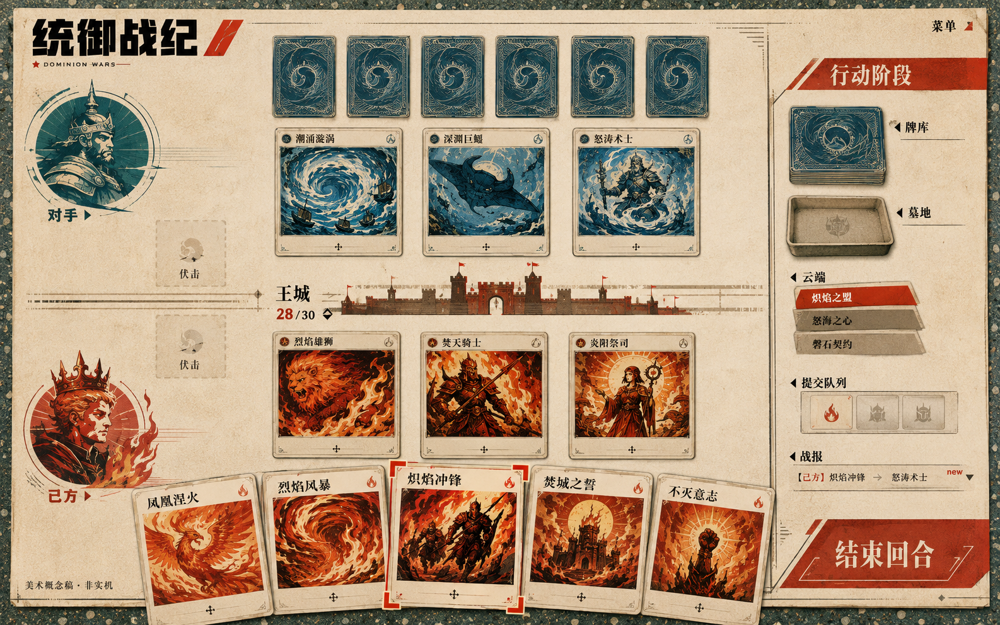

# 统御战纪 UI 与美术框架设计草案 v0.1

日期：2026-09-06。状态：供人类项目负责人审阅的视觉提案；未批准为最终视觉规范，未接入正式游戏。用户授权本轮整理完整草案并先交付概念效果图。本文不改变规则、数值、现有合同或生产资源。

## 1. 先看效果

此图用于确认构图、材质、配色和卡牌收藏感，是内置图像生成工具制作的合成概念图，非实机截图，非分层源文件。生成提示词见同目录 IMAGE_PROMPT.txt。

### 本图的已知差异

- 图中角色、卡图、卡名、战报和王城 28/30 均为生成占位，不能导入为正式内容。正式版采用当前 CardCatalog、引擎快照及公开信息；不得依据本图修改数据。
- 目前卡面偏插画展示，缺少完整惩罚值、攻防、类型、状态与规则区。下一步必须做真实长文案卡面排版，并用大卡详情承载完整说明。
- 敌方手牌只显示卡背；其他对方区域的展示也必须服从引擎给出的公开信息。
- 提交队列的三个格子只是生成图构图失误，不代表容量上限；正式版采用数量驱动的连续列表。云端同样不设三个位置上限，明确栈顶并按允许查看的信息展开。
- 图中右侧区域缺少完整双方归属和数量标识。正式版默认显示己方公共区域，以明确的己方/对方标签切换查看，禁止混合显示。
- 常驻左上标题和人物头像占位偏大，实机排版应缩小，优先保障卡面、目标与自己的生命等关键状态。
- 图中仿宋感小字、纸张污渍偏重；正式正文使用清晰中文字体，阅读区降低纹理。
- 本图只能确认静态美术气氛；无法证明转场、拖拽、响应、适配、性能或可访问性。

## 2. 核心视觉命题

“用现代清晰的版式，重新呈现九十年代小学旧卡牌里的幻想战争。”

小学怀旧负责纸张、地面、印刷和收藏情绪；构成主义负责斜切、大字与几何秩序；明日方舟的设计研究用于信息层次与阵营识别；女神异闻录式动效用于关键切换的力度。主界面无需搭建完整教室，避免空间场景抢占战斗。

语气：成熟、质朴、有力量、有收藏欲。避免霓虹科技面板、满屏徽章、泛黄到难以阅读、纯军事宣传画，以及无功能的满屏校园文具。幻想角色保持原阵营身份，不强行改成学生。

## 3. 项目素材审计与复用

本轮已核查：data/art 有 4 张 PNG：flame_leader、sea_leader、wood_leader、machine_alpha；data/content/authored/card_art 有对应文件。已目视检查火焰与海洋两张，都是横向阵营图形，不能当作完整角色立绘。两者的冠冕火焰和蓝色涡流可作为后续图案依据。

design/runtime-kit-v1.30/assets/source_svg 有 104 个文件，已有组件、图标、主题合同、皮肤清单、布局合同和动效预览；优先沿用其逻辑资产 ID 与语义。本轮数量清点不等于逐个素材审美或导入质量验收，也不据此断言仓库其他位置没有素材。

现有 default 皮肤映射包含 board、cardBack、castle、leaderFrame、factionFrame、uiIcon，并有 cardArtwork 扩展入口。新增细分槽位先形成兼容提案，默认皮肤必须能回退，不能直接宣称现有系统已支持所有新外观。

生成图沿用了目视提取的火焰/涡流图案方向，没有上传或像素级嵌入项目原图。新卡图仅供风格探索。缺少的定稿素材须在视觉确认后逐张生成与整理，不能从本图裁切冒充完整源资产。

## 4. 颜色、文字与材质

优先继承现有主题：纸 #F3EDE0、墨 #11110F、主动作红 #BC2C22、海 #2C5868、木 #596B43、机械 #B98C2E。更鲜明的朱红 #DF3B22 仅作为待试的转场强调色，不覆盖阵营与错误状态含义。

大面积纸与墨承担静态阅读，阵营色承担归属，饱和色强调当前交互。状态同时使用形状、文字或图标，不能只靠颜色。选中与危险分别设计角标和警示符号，避免都仅用红边。

标题采用有中文覆盖的粗黑体，少量裁切/斜切；正文采用清晰中文黑体，数字使用稳定宽度。具体字体文件、商业授权与中日英覆盖在导入前核验。正文不烧进纹理或卡图；保持现有本地化键。

参考 1440×900：常驻正文以约 18–22 px 开始打样，大卡正文约 22–26 px，关键数字约 26–36 px；这些为候选尺寸。小手牌显示短名、惩罚值与必要状态，完整规则转入详情，不能缩字号硬塞。

水磨石仅位于外围或菜单空白；中央对战垫使用低对比纸纤维。套色偏移、网点、磨边用于插画和装饰，不能作用于功能文字。阴影方向统一，以浅层纸张厚度为主。

## 5. 全界面规划

| 界面 | 视觉与布局 | 操作及状态要求 |
|---|---|---|
| 启动/资源错误 | 极简印刷校验页 | 真实加载状态、缺失资源原因、重试/退出；不用虚假进度 |
| 标题 | 旧卡盒封面式标题、纸与水磨石、一个主入口 | 首次进入与返回一致，避免长片头 |
| 主菜单 | 大号纵向目录、错位纸片、留白 | 对战、卡组、规则、设置；选中项保持定位 |
| 对局准备 | 双方卡组封面并列、模式清楚分区 | 沿现有模式及验证入口，不新增未实现联机 |
| 卡组编辑/收藏 | 左侧筛选与卡图网格，右侧构筑清单 | 搜索、排序、保存、无结果、无效构筑、未保存离开；合法性由现有验证提供 |
| 外观预览（后续） | 同位置预览不同纸面、卡背与卡图 | 本轮只有设计槽位，无购买、价格、稀有度经济与到账实现 |
| 规则书 | 清晰书页、章节标签、词条检索 | 与权威规则同步，长文滚动，返回位置保留 |
| 教学 | 复用战斗组件和局部注释 | 只高亮真实可执行动作，不另写规则 |
| 设置 | 稀疏行式排版 | 语言、字号、音量、动态强度、对比与操作辅助 |
| 对战加载 | 对阵封面与简短几何切换 | 加载失败返回准备页，转换期间不重复提交 |
| 战斗 | 上敌下我、中央王城、右侧公共区域 | 详见下一节 |
| 暂停/确认 | 小面积纸层覆盖，保留桌面上下文 | 恢复、设置、离开确认；网络对局是否暂停不得由外观推定 |
| 结算 | 胜负大字、一次印章式落版 | 胜负原因来自引擎，可查看战报、重开、返回 |
| 战报 | 按因果顺序的简洁印刷条目 | 可展开查看来源、目标和效果，不抢占主战场 |

这些页面对应现有 screen_flow 为主；外观预览是后续候选，不表示已批准上线。每页需要默认、悬停、焦点、禁用、空白、错误与加载等适用状态。

## 6. 战斗界面与卡面

优先保留布局合同的上方对手、中央王城、下方己方、底部手牌、右侧阶段/主动作结构。新样稿中头像与右侧区域的具体尺寸属于候选，后续与当前 Unity 实现和合同作逐项对照，不直接覆盖 layout_contract。

手牌抬起跟随指针，合法目标用角标与边界强调；非法放置回到原位并给短文字提示。选择、出牌、攻击、结束回合、弃牌、响应及云端操作全部消费权威 LegalActions，不凭卡面颜色或卡名推断。

右侧牌库显示卡背与数量；墓地显示可公开内容与数量，展开进入可滚动列表；提交队列与云端明确区分，前者展示队列顺序，后者突出栈顶。视觉上“已选中”和“当前可下载”分开。大量卡不截断成固定容量。

响应提示靠近相关卡与主操作区，标明来源、对象和当前选择；连锁展开采用可回看的事件条，不连续全屏播片。伏击保持卡背及归属，未公开内容不进入详情。统领、玩家生命、王城与特殊胜利进度只显示当前模型实际提供的状态。

卡面分三档：手牌缩略、场上状态、大卡详情。名称、类型/阵营、打印惩罚值、适用时的当前攻防、关键词及变化状态按信息重要性排布。不增加未经规则确认的第二套法力费用。卡图不能挤掉规则区；长词条在详情完整展开。

## 7. 阵营视觉体系（候选）

| 阵营 | 图形方向 | 插画处理 |
|---|---|---|
| 火焰 | 放射、冠冕、上升尖角 | 红黑橙的版画、鲜明剪影 |
| 海洋 | 涡流、等深线、横向延伸 | 蓝绿套印、流动线与细网点 |
| 森林 | 年轮、枝杈、叶脉 | 植物图谱与粗细线结合 |
| 机械 | 编号、定位线、模块结构 | 工业说明书式双色版画 |

各阵营共享卡面信息骨架。人物轮廓、材质和构图允许差异，不能仅换色；保持原卡牌身份与世界观。拟定的新图像不反向产生新规则。

## 8. 动效与声音草案

| 场景 | 候选时长 | 动作 |
|---|---|---|
| 悬停/焦点 | 100–160 ms | 轻抬起、角标出现 |
| 抽屉/详情 | 180–280 ms | 从入口方向展开纸层，正文最后短淡入 |
| 整屏切换 | 350–500 ms | 多边形进入→遮罩交接→标题落位→内容稳定 |
| 阶段变化 | 250–350 ms | 局部斜条穿过阶段区，主战场保持位置 |
| 胜负 | 600–900 ms | 大字与一次印章落版，可跳过后续装饰 |

复用现有 MOVE、SCALE、CLIP_REVEAL、MASK_SWAP 等语义并映射到 Unity。时长是打样值。动画只反映引擎事件，不能推进规则；处理快速点击、反向导航、动画中断和重复事件。减少动态模式用短淡入，取消旋转/大幅位移及全屏强对比闪烁。

声音候选：纸张划过、卡片轻落、低而短的木质/印章触感。连续触发限制叠音与峰值；音量独立设置。本轮未制作声音或可播放转场。

## 9. 分层素材与外观扩展

| 层 | 独立资源 | 生产要求 |
|---|---|---|
| 环境 | 水磨石、桌沿、背景光影 | 平铺材质与光影分离，无界面文字 |
| 对战垫 | 纸面、边饰、区域底纹 | 读字区安静，区域标签由程序绘制 |
| 卡牌插画 | 背景、主体、前景/特效 | 分层原稿与透明导出，主体安全区一致 |
| 卡牌组件 | 框、背、角标、阴影 | 延用逻辑 ID；文字和状态独立 |
| 公共区域 | 牌库/墓地/云端/提交队列装饰 | 点击区、归属、数量与可操作状态稳定 |
| 通用 UI | 按钮、标签、图标、选中框 | 优先复用 SVG，边框用可伸缩资源 |
| 动效 | 遮罩、切片、粒子、声音 | 时序与素材分离，可降级和打断 |

将来外观可以单售或组合，但价格、付费机制、所有权、支付与发布均不在本轮范围。所有外观必须保留可读性和默认回退，不能靠收费获得更清楚的状态提示。

建议交付：SVG 源图标；PNG 透明图；纹理及其平铺说明；必要时 Blender 场景；主题和皮肤映射；尺寸/安全区/命名清单；来源、生成提示词及授权记录。插画源图按展示尺寸保留约 2 倍余量，最终导入尺寸和压缩经性能检查确定。

## 10. 工具与制作顺序

采用 2D 为主、少量 3D 辅助：内置图像生成用于概念、插画与纹理；现有 SVG 用于精确 UI；Blender 用于确有收益的卡盒、浅层桌面与一致光照，先考虑预渲染；Unity 承担真实交互和动态遮罩。Canva 可用于后续评审板，本轮交付为本地草案和概念图，未创建 Canva 设计。

阶段 A（本轮）：素材核查、完整文字草案、一张静态战斗概念图、局限记录。

阶段 B（视觉确认后）：用现有真实卡名和长规则制作战斗精确布局、大卡详情与主菜单；展示一段可操作转场；以高信息密度局面验证。

阶段 C：按已确认方向拆分/生成素材，制作组件状态库和其余页面；完善四阵营视觉与两套可互换外观样例。

阶段 D：批准范围内接入 Unity，PL/QA 按项目现行流程评审；正式资源不能通过截取效果图交付。

## 11. 验收与风险

- 在 1440×900 与 1280×720 检查自己的全部手牌均可访问，长中文规则可完整阅读；战报可收起。
- 鼠标、键盘焦点、拖放与可用的替代操作路径一致；交互目标至少满足合同中 44 参考像素要求。
- 覆盖空牌库、空墓地、大量云端/队列卡、长词条、多层响应、隐蔽卡、非法拖放和终局。
- 样式替换不改变合法性、坐标语义和隐藏信息，不把生成图数值写回规则。
- 目标设备实测纹理内存、动画帧耗和加载；概念图不能证明性能。本轮没有跑游戏测试，因为未修改运行代码。
- 当前风险：怀旧纹理可能过重；卡面正文需重新排版；右侧双方归属不完整；生成图不是分层源文件；动画仍待验证。

## 12. 本轮评审重点

请优先判断：纸张/水磨石的怀旧浓度是否合适；版画卡图是否符合预期；静态界面是否需要更强的多边形构图。默认保留本图暖纸、蓝红套印和安静牌桌的方向，正式尺寸与内容由后续精确稿修正。最终视觉方向由人类项目负责人确定。

## 13. 参考与证据

- 项目：docs/RULES.md、docs/DAILY_GOAL.md、data/cards、data/art、data/content/manifests/skins/default.json。
- 合同：design/runtime-kit-v1.30/contracts 下的 layout_contract、theme_contract、skin_manifest.schema、screen_flow、motion_primitives；现有 1.31 运行合同保持原有权威边界。
- Unity 官方发布，海猫/黄一峰分享《明日方舟》中 3D 与 2D 结合方案：https://www.bilibili.com/video/av755481241/ 。本轮沿用前一轮核对的页面介绍，未声称完整观看。
- 4Gamer 直接访谈（2019）：https://www.4gamer.net/games/442/G044288/20190906113/ 。借鉴世界观与视觉同步形成、体验导向的取舍原则。
- 明日方舟官方 PV 档案：https://ak.hypergryph.com/archive/video 。后续动态研究入口，不代表已经逐帧拆解。
- P5R 官方视觉参考：https://persona.atlus.com/p5r/?lang=en 。仅借鉴切换方法，制作原创构图和素材。

上述参考不构成对本项目设计的官方背书。全部数值、布局与外观提议均以本草案状态为准。
